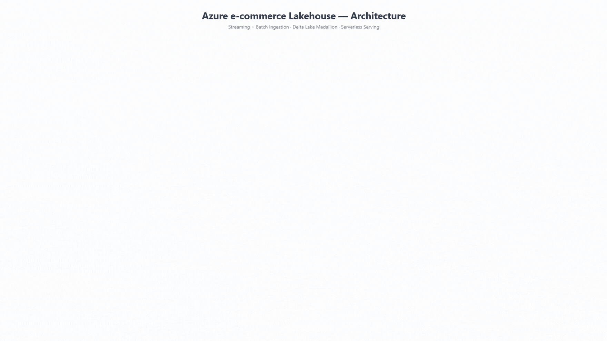
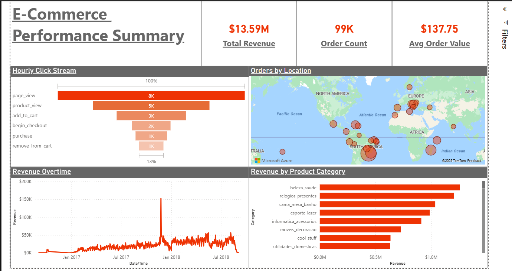

# Azure E-Commerce Lakehouse

[](https://github.com/Fawad98/azure-ecommerce-lakehouse/actions/workflows/ci.yml)

An end-to-end data platform on Microsoft Azure that ingests **streaming clickstream** and **batch transactional** data into a Delta Lake medallion architecture, models it into a star schema with slowly-changing dimensions, enforces data quality, and serves analytics to Power BI. The entire platform is provisioned from code with Terraform and gated by CI/CD.

> Built as an advanced portfolio project to demonstrate production data-engineering practice, not just a working pipeline: idempotency, quarantine handling, verified state transitions, referential integrity, testing, and observability.

---

## Architecture



Two ingestion legs converge on a shared medallion lake:

- **Streaming** — a simulator publishes clickstream events to **Event Hubs** (Kafka endpoint); Databricks Structured Streaming lands them raw in **bronze**, then cleanses, deduplicates, and quarantines into **silver**.
- **Batch** — the Olist e-commerce dataset sits in **Azure SQL**; a metadata-driven **Data Factory** pipeline incrementally copies each table to bronze, from where Databricks conforms it into **silver**.

From silver, Databricks builds the **gold** star schema (SCD2 customer dimension, SCD1 product, generated date, two fact tables), a data-quality gate validates it, and a **Databricks SQL Warehouse** serves it to **Power BI**.

```
Event Hubs ─► bronze/clickstream ─► silver/events ─┐
                                                    ├─► gold (star schema) ─► DQ gate ─► SQL Warehouse ─► Power BI
Azure SQL ─► ADF ─► bronze/sqldb ─► silver/olist ──┘
```

---

## Tech stack

| Layer | Technology |
|---|---|
| Streaming ingestion | Azure Event Hubs (Kafka), Databricks Structured Streaming |
| Batch ingestion | Azure SQL, Azure Data Factory (metadata-driven) |
| Storage | ADLS Gen2, Delta Lake (medallion: bronze/silver/gold/quarantine) |
| Transformation | Databricks (PySpark), Unity Catalog |
| Modelling | Star schema, SCD Type 2 |
| Serving | Databricks SQL Warehouse, Power BI |
| IaC | Terraform (remote state in Azure Storage) |
| CI/CD | GitHub Actions (pytest, ruff, terraform validate) |
| Secrets | Azure Key Vault |
| Orchestration & alerting | ADF pipelines, Logic App email alert |

---

## Dashboard



Revenue trends, category and geographic breakdowns, KPI cards, and an hourly clickstream funnel sourced from the streaming leg — so the single dashboard spans both batch and stream.

---

## Medallion design

**Bronze** stores payloads exactly as received — no parsing, no filtering. This immutability made every transformation bug recoverable by replay rather than re-ingestion (it saved a rebuild three separate times during development).

**Silver** enforces quality. The clickstream simulator deliberately injects four defects, each mapped to a real production failure mode and a named handling pattern:

| Injected defect | Handling in silver |
|---|---|
| ~3% null `user_id` | Validation gate → quarantine with reason code |
| ~2% duplicate events | Deduplication bounded by a 2-hour watermark |
| ~3% late arrivals | Event-time processing + watermark |
| ~2% schema drift (`campaign_id`) | Explicit schema declaration |

A representative run: **19,890 bronze → 647 quarantined (3.25%) → 389 deduplicated (1.96%) → 18,854 silver**, every row accounted for.

**Gold** is a Kimball star schema:

- `dim_customer` — **SCD Type 2**, full history of location changes, keyed on `customer_unique_id`
- `dim_product` — SCD1 (attribute changes are corrections, not events)
- `dim_date` — generated 2016–2027
- `fact_orders` — grain: one row per order line item; row count reconciles exactly to `silver/order_items`
- `fact_events_hourly` — streaming aggregate

Facts that cannot resolve a dimension member are routed to an explicit **unknown member** (`sk = -1`) rather than dropped, so totals reconcile and the unresolved rate is measurable.

---

## Data quality gates

A dependency-light assertion framework validates gold after every run and **fails the pipeline** on breach: not-null and non-negative checks, one-current-row-per-key for the SCD2 dimension, referential integrity from facts to every dimension, and a monitored unknown-member rate. Results are appended to a `_dq_results` Delta table with a run timestamp, so quality is trended over time rather than checked once.

---

## Engineering decisions worth calling out

A few choices that separate this from a tutorial pipeline (full write-ups in [`docs/design-decisions.md`](docs/design-decisions.md) and [`docs/challenges-and-solutions.md`](docs/challenges-and-solutions.md)):

- **Watermarks advance only after verified landing.** An early bug advanced a Data Factory watermark on Copy *success*, but the data had been written to the wrong path — so the next run skipped ~99k rows while reporting success. The fix: a Get Metadata check confirms files exist at the sink before the watermark commits, and holds it on failure so the next run reprocesses. *State that records progress must only advance after the effect it describes is verified, not after the operation that intends it returns success.*

- **Quality gates test outcomes, not mechanisms.** A quarantine split ran correctly but its predicate omitted `user_id`, so 636 null-user rows passed silently into silver. A downstream check asserting a *property of silver* caught it — a test of the mechanism alone would have passed.

- **Unity Catalog storage access.** UC-governed compute blocks cluster-level storage credentials entirely; access goes through an access connector, storage credential, and external locations. Interactive and job clusters run under different principals, so grants must cover both.

- **Serving via Databricks SQL instead of Synapse.** Both expose gold to BI over SQL; the Databricks path keeps querying and governance in one engine with no second service to provision.

- **Terraform state recovered by import.** After losing a dev VM (and its local state file), 16 live resources were reconciled into a fresh state with `terraform import` — zero downtime, zero recreation. Remote state was then configured so the failure mode can't recur.

---

## Repository layout

```
infra/            Terraform: lake, Event Hubs, SQL, ADF, Databricks, Key Vault
notebooks/        Databricks: 01 stream ingest → 05 data quality
data_generator/   Clickstream simulator + Olist loader
pipelines/        Data Factory JSON (Git-integrated)
src/              Pure transformation functions (unit-tested)
tests/            pytest suite
sql/              Control tables, gold serving views, KQL monitoring
powerbi/          Power BI report
docs/             Architecture, design decisions, challenges log, images
.github/workflows/ CI (tests, lint, validate) and CD (deploy)
```

---

## Running it

Prerequisites: an Azure subscription, Terraform, Azure CLI, and a Databricks workspace.

```bash
# 1. Provision infrastructure
cd infra
terraform init
terraform apply

# 2. Load the batch source and start the stream
python data_generator/load_olist.py
python data_generator/simulator.py

# 3. Run the notebooks (or trigger the ADF pipeline that orchestrates them)
#    01 → 02 → 02b → 03 → 04 → 05
```

The whole platform provisions from code in roughly 20 minutes and tears down cleanly with `terraform destroy` — which is itself the proof that the IaC is reproducible rather than a one-time manual setup.

---

## CI/CD

- **CI** (every push / PR): ruff lint, pytest unit tests on a local Spark session, `terraform fmt` + `validate`.
- **CD** (manual, gated): deploys notebooks to the workspace and applies Terraform behind a required-reviewer approval.
- **Observability**: ADF diagnostic logs to Log Analytics, a KQL pipeline-health query, and a Logic App email alert wired to the data-quality gate.
